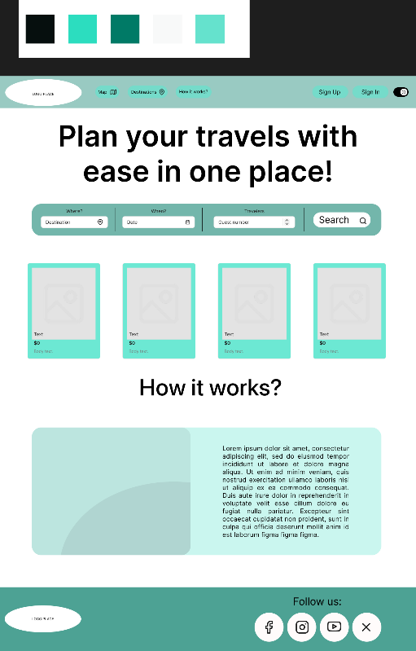

**1. Áttekintés**

Egy olyan komplex utazástervező weboldalt fejlesztünk, amelynek célja a
bel- és külföldi utazások egyszerűbb és átláthatóbb megtervezése. A
rendszer modern webes technológiákra épül (Next.js, React,Express
backend), és lehetőséget biztosít keresésre, térkép alapú áttekintésre,
valamint programok, szállások és éttermek kiválasztására. Kiemelt
funkciója az oldalnak a mesterséges intelligencia (AI) integrációja,
amely segítségével a felhasználók ajánlásokat kérhetnek vagy teljes
utazásokat tervezhetnek meg pár kattintással. A közösségi élményt a
véleményezés és a fotófeltöltés lehetősége biztosítja. A felhasználók
saját fiókjukban kezelhetik utazásaikat, és egy interaktív térképen
követhetik nyomon, hány országban jártak eddig.

**2. Jelenlegi helyzet**

Jelenleg az utazástervezés hosszú és időigényes feladat, mivel a
foglalások és programok külön-külön oldalakon érhetőek el. A
felhasználóknak egyszerre kell figyelniük a szállásoldalakat, árakat,
programokat és egyéb információkat, ami miatt a folyamat átláthatatlan,
és könnyen elfelejtődhetnek fontos részletek. A különböző oldalak
gyakran nem kommunikálnak egymással, így az adatok átvitele nehézkes,
hibalehetőségeket rejt magában.

**3. Követelménylista**

Az alábbi táblázat részletezi a rendszerrel szemben támasztott
funkcionális követelményeket:

  ------------------------------------------------------------------------------------------
  **Modul**         **ID**   **Név**              **v.**   **Kifejtés**
  ----------------- -------- -------------------- -------- ---------------------------------
  **Jogosultság**   K1       Regisztráció         1.0      A felhasználó vezetéknév,
                                                           keresztnév, e-mail és jelszó
                                                           megadásával, vagy Google fiókkal
                                                           regisztrálhat. A jelszót
                                                           titkosítva (hash) tároljuk.

  **Jogosultság**   K2       Bejelentkezés        1.0      Belépés e-mail/jelszó párossal
                                                           vagy Google fiókkal. Sikertelen
                                                           belépés esetén hibaüzenet.

  **Profil**        K3       Profilkezelés        1.0      Adatok és profilkép módosítása.
                                                           \"Meglátogatott országok\"
                                                           térképének és saját fotók
                                                           megtekintése és kezelése.

  **Térkép**        K4       Interaktív keresés   1.0      Mapbox alapú térképes keresés
                                                           városokra, látványosságokra.
                                                           Részletek megjelenítése
                                                           információs buborékban.

  **Tervezés**      K5       Új utazás            1.0      Új utazás létrehozása névvel,
                                                           dátummal. Privát vagy Publikus
                                                           láthatóság beállítása.

  **Tervezés**      K6       Program hozzáadása   1.0      Helyszínek (szállás, étterem)
                                                           hozzáadása a tervezett utazás
                                                           napjaihoz térképről vagy
                                                           keresőből.

  **AI Funkció**    K7       AI Ajánló            1.0      Helyszínhez és preferenciákhoz
                                                           igazított programajánlás kérése
                                                           az AI-tól manuális tervezés
                                                           közben.

  **AI Funkció**    K8       AI Tervezőgenerátor  1.0      Komplett, napi bontású útiterv
                                                           generálása úti cél, időtartam és
                                                           stílus alapján a Google Gemini
                                                           API segítségével.

  **Közösség**      K9       Véleményezés         1.0      Szöveges és csillagos értékelés
                                                           írása a helyszínekhez.

  **Közösség**      K10      Képfeltöltés         1.0      Fotók feltöltése helyszínekhez
                                                           vagy saját utazási naplóhoz.

  **Admin**         K11      Tartalomfelügyelet   1.0      Adminisztrátorok általi
                                                           tartalomtörlés (szabálysértő
                                                           képek, kommentek) és felhasználók
                                                           felfüggesztése.

  **Adatvédelem**   K13      Fiók törlése         1.0      A felhasználó kérheti adatai
                                                           törlését az \"elfeledtetés joga\"
                                                           alapján (GDPR).
  ------------------------------------------------------------------------------------------

**4. Jelenlegi üzleti folyamatok modellje**

A mai világban egy utazás megszervezése során a felhasználó figyelme
megoszlik a rengeteg keresés és információforrás között. A folyamat
során több, egymástól független weboldalt kell használni a szállások,
éttermek és programok felkutatására. Mivel ezek az oldalak nem
kommunikálnak egymással, az adatok (pl. dátumok, címek) átvezetése
manuálisan történik, ami időigényes és hibákhoz vezethet.

**5. Igényelt üzleti folyamatok modellje**

-   **Belépés:** A főoldalon a felhasználó ismertetőt lát, majd
    regisztrálhat vagy bejelentkezhet.

-   **Inspiráció:** A felhasználó szabadon böngészhet a térképen,
    megtekintheti az országok ajánlatait és mások értékeléseit, képeit.

-   **Tervezés:** A felhasználó létrehozhat egy utazást, amelyhez
    manuálisan válogat programokat, vagy az AI segítségével generáltat
    egy teljes tervet.

-   **Kezelés:** A profil oldalon elérhetőek a tervezett túrák
    módosításra, valamint a felhasználó személyes térképe a bejárt
    országokkal és feltöltött a képei.

-   **Moderálás:** Az adminisztrátorok külön felületen felügyelik a
    tartalmakat és szükség esetén beavatkoznak.

**6. Használati esetek**

> **Vendég (Nem regisztrált felhasználó):**

-   Megtekintheti a főoldalt és az ismertetőt.

-   Böngészhet a térképen és megtekintheti a publikus
    helyszíneket/értékeléseket.

-   Regisztrálhat vagy bejelentkezhet.

```{=html}
<!-- -->
```
-   **Regisztrált Felhasználó:**

    -   Minden vendég funkció elérése.

    -   Profil szerkesztése, saját térkép (járt országok) kezelése.

    -   Új utazás létrehozása, szerkesztése, törlése (manuálisan vagy
        AI-val).

    -   Vélemények írása, képek feltöltése.

    -   Beállítások kezelése (pl. sötét mód).

-   **Adminisztrátor:**

    -   Belépés az admin felületre.

    -   Megosztott tartalmak, értékelések, képek megtekintése és
        törlése, ha azok jogsértőek vagy nem megfelelőek (pl.: erőszak,
        szexualitás).

    -   Fiókok felfüggesztése vagy törlése szabályszegés esetén.

**7. Megfeleltetés (Használati esetek és Követelmények)**

-   A **Regisztráció és Bejelentkezés** használati esetek lefedik a
    **K1** és **K2** követelményeket.

-   A **Tervezés** (manuális és AI) használati esetek lefedik a **K5,
    K6, K7, K8** követelményeket.

-   A **Közösségi interakciók** (értékelés, feltöltés) lefedik a **K9**
    és **K10** követelményeket.

-   Az **Adminisztrátori tevékenységek** lefedik a **K11** követelményt
    és a jogi megfelelést (GDPR, Copyright).

**8. Képernyő tervek**

A rendszer főbb képernyői a következők:

-   **Főoldal (Landing Page):** Rövid ismertető, biztatás a
    csatlakozásra, bejelentkezés/regisztráció gombok.

> {width="2.3075513998250217in"
> height="3.1847222222222222in"}

-   **Térképnézet:** Teljes képernyős Mapbox térkép keresősávval.
    Helyszínre kattintva információs ablak ugrik fel részletekkel.

-   **Tervező felület:**

    -   Bal oldalon: Dátumválasztó, napi bontású lista.

    -   Jobb oldalon: Kereső vagy AI segéd panel (chat-szerű felület az
        ajánlásokhoz).

-   **Profil oldal:** Felhasználói adatok, \"Meglátogatott országok\"
    minitérkép, mentett utazások listája kártyás elrendezésben,
    feltöltött képek galériája.

-   **Admin Dashboard:** Listanézet a jelentett tartalmakról,
    felhasználókról, törlés/tiltás gombokkal.

**9. Forgatókönyv**

**Példa forgatókönyv: Egy hétvégi római kiruccanás tervezése**

1.  **Szereplők:** A felhasználó (utazó) és a Rendszer (beleértve az AI
    modult).

2.  **Kezdet:** A felhasználó belép a profiljába, és kiválasztja az \"Új
    utazás\" gombot.

3.  **Folyamat:**

    -   A felhasználónak nincs konkrét terve, ezért az **AI
        Tervezőgenerátort** választja.

    -   Beírja a paramétereket: \"Róma, 3 nap, művészet és
        gasztronómia\".

    -   A rendszer (Gemini API) legenerálja a napi bontást
        szállásjavaslattal, éttermekkel és múzeumokkal.

    -   A felhasználó elmenti a tervet, de az egyik éttermet kicseréli
        egy a térképen talált, jobb értékelésű helyre.

    -   Az utazás során a telefonján megnyitja a tervet, és a
        meglátogatott Colosseumnál feltölt egy fotót és ír egy rövid
        értékelést.

4.  **Eredmény:** A felhasználó profilján frissül a \"járt országok\"
    térkép (Olaszország), és a feltöltött képe bekerül a galériájába.

**10. Funkció - követelmény megfeleltetés**

-   A **Google Gemini API** integrációja biztosítja a **K7** és **K8**
    (AI funkciók) teljesülését.

-   A **Mapbox API** implementálása biztosítja a **K4** (Térkép) és a
    **K3** (Profil térkép) működését.

-   A **Next.js és React** keretrendszer biztosítja a reszponzív
    megjelenítést asztali és mobil eszközökön egyaránt.

-   Az **SQL adatbázis** és **Prisma ORM** felel az adatok
    (felhasználók, tervek, értékelések) tárolásáért és a **K1-K13**
    követelmények háttértámogatásáért.

**11. Fogalomszótár**

-   **\[Next.js\]:** React-alapú keretrendszer, amely szerveroldali
    renderelést is biztosít, ezzel segítve a gyors betöltést és SEO-t.

-   **\[Prisma\]:** Modern ORM (Object-Relational Mapping) eszköz, amely
    leegyszerűsíti az adatbázis-kapcsolatok kezelését a kód szintjén.

-   **\[Mapbox API\]:** Külső térképi szolgáltatás és keresőmotor, amely
    a rendszer vizuális alapját adja.

-   **\[Gemini API\]:** A Google által fejlesztett mesterséges
    intelligencia modell, amely a rendszer szöveges generáló és ajánló
    funkcióit látja el.

-   **\[JSON\]:** (JavaScript Object Notation) Adatcsere formátum, amit
    az AI és az adatbázis közötti kommunikációhoz használunk.

-   **\[GDPR\]:** Az Európai Unió Általános Adatvédelmi Rendelete,
    amelynek a rendszer adatkezelésének meg kell felelnie.

1.  **Overview**

> We are developing a complex travel planning website aimed at making
> the planning of domestic and international trips simpler and more
> transparent. The system is built on modern web technologies (Next.js,
> React, Express backend), and provides opportunities for searching,
> map-based overview, and selecting programs, accommodations, and
> restaurants. A prominent feature of the site is the integration of
> artificial intelligence (AI), which allows users to ask for
> recommendations or plan entire trips with a few clicks. The community
> experience is provided by the possibility of reviewing and uploading
> photos. Users can manage their trips in their own accounts and track
> how many countries they have visited so far on an interactive map.

2.  **Current Situation**

> Currently, travel planning is a long and time-consuming task, as
> bookings and programs are available on separate pages. Users have to
> simultaneously monitor accommodation sites, prices, programs, and
> other information, which makes the process opaque and easy to forget
> important details. Different pages often do not communicate with each
> other, making data transfer cumbersome and prone to errors.

3.  **Requirements**

> List The following table details the functional requirements for the
> system:

  ---------------------------------------------------------------------------------------
  **Module**      **ID**   **Name**       **v.**   **Explanation**
  --------------- -------- -------------- -------- --------------------------------------
  **Auth**        K1       Registration   1.0      The user can register by providing
                                                   their last name, first name, e-mail,
                                                   and password, or with a Google
                                                   account. The password is stored
                                                   encrypted (hashed).

  **Auth**        K2       Login          1.0      Login with an e-mail/password pair or
                                                   a Google account. Error message in
                                                   case of unsuccessful login.

  **Profile**     K3       Profile        1.0      Modifying data and profile picture.
                           Management              Viewing and managing the \"Visited
                                                   countries\" map and own photos.

  **Map**         K4       Interactive    1.0      Mapbox-based map search for cities and
                           Search                  attractions. Displaying details in an
                                                   information bubble.

  **Planning**    K5       New Trip       1.0      Creating a new trip with a name and
                                                   date. Setting Private or Public
                                                   visibility.

  **Planning**    K6       Add Program    1.0      Adding locations (accommodation,
                                                   restaurant) to the days of the planned
                                                   trip from the map or search engine.

  **AI Feature**  K7       AI Recommender 1.0      Requesting a program recommendation
                                                   tailored to the location and
                                                   preferences from the AI during manual
                                                   planning.

  **AI Feature**  K8       AI Planner     1.0      Generating a complete, daily breakdown
                           Generator               itinerary based on destination,
                                                   duration, and style using the Google
                                                   Gemini API.

  **Community**   K9       Reviewing      1.0      Writing a text and star rating for
                                                   locations.

  **Community**   K10      Image Upload   1.0      Uploading photos to locations or own
                                                   travel diary.

  **Admin**       K11      Content        1.0      Content deletion by administrators
                           Moderation              (rule-violating images, comments) and
                                                   suspending users.

  **Data          K13      Delete Account 1.0      The user can request the deletion of
  Protection**                                     their data based on the \"right to be
                                                   forgotten\" (GDPR).
  ---------------------------------------------------------------------------------------

4.  **Model of Current Business Processes**

> In today\'s world, organizing a trip divides the user\'s attention
> among a multitude of searches and information sources. During the
> process, several independent websites must be used to find
> accommodations, restaurants, and programs. Since these pages do not
> communicate with each other, transferring data (e.g., dates,
> addresses) is done manually, which is time-consuming and can lead to
> errors.

**5. Model of Desired Business Processes**

-   **Login:** On the main page, the user sees an introduction, then can
    register or log in.

-   **Inspiration:** The user can freely browse the map, view the offers
    of countries, and read others\' reviews and photos.

-   **Planning:** The user can create a trip, for which they manually
    select programs, or generate a complete plan using AI.

-   **Management:** On the profile page, the planned tours are available
    for modification, as well as the user\'s personal map with the
    visited countries and uploaded photos.

-   **Moderation:** Administrators monitor the content on a separate
    interface and intervene if necessary.

**6. Use Cases**

-   **Guest (Unregistered user):**

    -   Can view the main page and the introduction.

    -   Can browse the map and view public locations/reviews.

    -   Can register or log in.

-   **Registered User:**

    -   Access to all guest functions.

    -   Profile editing, managing own map (visited countries).

    -   Creating, editing, and deleting a new trip (manually or with
        AI).

    -   Writing reviews, uploading pictures.

    -   Managing settings (e.g., dark mode).

-   **Administrator:**

    -   Log in to the admin interface.

    -   Viewing and deleting shared content, reviews, and images if they
        are unlawful or inappropriate (e.g., violence, sexuality).

    -   Suspending or deleting accounts in case of a rule violation.

**7. Mapping (Use Cases and Requirements**)

-   The Registration and Login use cases cover requirements K1 and K2.

-   The Planning (manual and AI) use cases cover requirements K5, K6,
    K7, K8.

-   The Community interactions (review, upload) cover requirements K9
    and K10.

-   The Administrator activities cover requirement K11 and legal
    compliance (GDPR, Copyright).

**8. Screen Designs**

The main screens of the system are the following:

-   **Main page (Landing Page):** Short introduction, encouragement to
    join, login/registration buttons.

> {width="2.3075513998250217in"
> height="3.1847222222222222in"}

-   **Map view:** Full-screen Mapbox map with a search bar. Clicking on
    a location pops up an information window with details.

-   **Planner interface:**

    -   Left side: Date picker, daily breakdown list.

    -   Right side: Search or AI assistant panel (chat-like interface
        for recommendations).

-   **Profile page:** User data, \"Visited countries\" minimap, list of
    saved trips in a card layout, gallery of uploaded photos.

-   **Admin Dashboard:** List view of reported content, users, with
    delete/ban buttons.

**9. Scenario Example scenario: Planning a weekend getaway to Rome**

1.  **Actors:** The user (traveler) and the System (including the AI
    module).

2.  **Start:** The user logs into their profile and selects the \"New
    trip\" button.

3.  **Process:**

    -   The user has no specific plan, so they choose the AI Planner
        Generator.

    -   Enters the parameters: \"Rome, 3 days, art and gastronomy\".

    -   The system (Gemini API) generates the daily breakdown with
        accommodation suggestions, restaurants, and museums.

    -   The user saves the plan but swaps one restaurant for a
        better-rated place found on the map.

    -   During the trip, they open the plan on their phone, and at the
        visited Colosseum, they upload a photo and write a short review.

4.  **Result:** The \"visited countries\" map on the user\'s profile is
    updated (Italy), and their uploaded picture is added to their
    gallery.

**10. Function - Requirement Mapping**

-   The integration of the Google Gemini API ensures the fulfillment of
    K7 and K8 (AI functions).

-   The implementation of the Mapbox API ensures the operation of K4
    (Map) and K3 (Profile map).

-   The Next.js and React framework ensures responsive display on both
    desktop and mobile devices.

-   The SQL database and Prisma ORM are responsible for storing data
    (users, plans, reviews) and supporting requirements K1-K13 in the
    background.

**11. Glossary**

-   **\[Next.js\]:** React-based framework that also provides
    server-side rendering, thereby helping fast loading and SEO.

-   **\[Prisma\]:** Modern ORM (Object-Relational Mapping) tool that
    simplifies database connection management at the code level.

-   **\[Mapbox API\]:** External mapping service and search engine that
    provides the visual basis of the system.

-   **\[Gemini API\]:** Artificial intelligence model developed by
    Google, which performs the text generation and recommendation
    functions of the system.

-   **\[JSON\]:** (JavaScript Object Notation) Data exchange format used
    for communication between the AI and the database.

-   **\[GDPR\]:** The General Data Protection Regulation of the European
    Union, which the system\'s data management must comply with.
